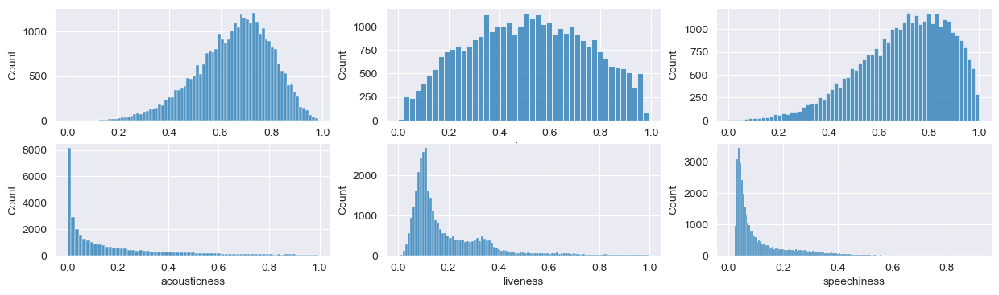

#  Spotify Songs

30.000 songs bis anfang 2020

---

## Data structure

- popularity
- date
- playlist_genre
- playlist_subgenre
- key
- mode
- tempo
- duration_ms

---

### Popularity?

The popularity of a track is a value between 0 and 100, with 100 being the most popular. The popularity is calculated by algorithm and is based, in the most part, on the total number of plays the track has had and how recent those plays are. 

---

## Data structure

##### interesting for AI

- energy
- loudness
- danceability
- speechiness
- acousticness
- instrumentalness
- liveness
- valence

--- 

## Locking at Data

---

## popularity - length

---

## length

---

## popularity - genre

---

## genre

---

## genre

popular songs only

---

## tempo - genre

---

## tempo - genre

---

## music

